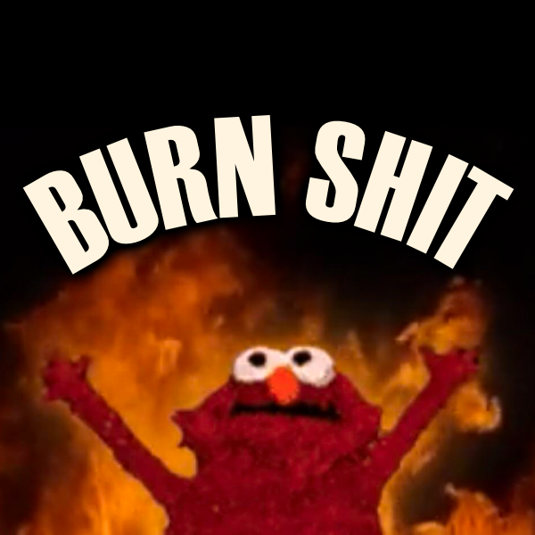

# Burn Shit for Anomaly and GAMMA

Permanently dispose of items by burning them in campfires, using either the inventory's context menu or drag and drop. It's like a poor-man's version of the Recycle Bin mod, except dumbed down and minimal.

Holding onto a bunch of junk because you can't stop hoovering the zone? Not worth your time trekking to a trader to sell it? Don't want to disturb the zen of your chi'd-out safehouse by dropping it on the floor? Don't want others to fill their inventories with your trash? Want to salvage a couple frames on your potato? Throw that shit in the fire.

You can throw anything that's not a quest item in the fire. Yes, even things you'd think would be too big, inflammable, or straight up dangerous. This mod was made for convenience not realism.

You have to be within ~3m of a fire to activate the menu items, and within ~2m to drag and drop. Burning shit makes a "whoosh" fire sound. When using the "burn all" menu item, the sound gets louder when many items are burned at once.

There are MCM options to:
- Enable/disable the context menu
- Enable/disable drag-and-drop functionality
- Enable/disable burning of quest items
- Enable/disable burning of tradeable items
- Configure visibility of the "burn all" menu item

There is also a config file option to enable/disable burning of individual items (you just have to know the section name).

## Installation

1. Click this link and download the attached ZIP file:
2. Install it with Mod Organizer 2 (the one included with GAMMA): https://anomalymodding.blogspot.com/2021/04/Mod-Organizer-2-setup-and-Amomaly-modding-guide.html (priority doesn't matter).
3. Go to Mod Configuration Menu -> Burn Shit to customize and configure.
